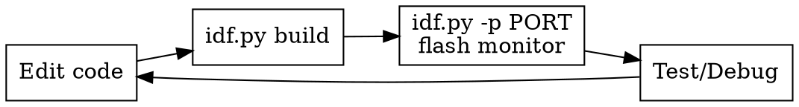

# ESP-IDF Build, Flash, Monitor

## Overview

The core ESP-IDF development loop: configure with menuconfig, build with CMake, flash over serial, monitor output. All wrapped by `idf.py`.

## Core Development Loop



## Quick Reference

| Task | CLI Command | VS Code Command |
|------|------------|-----------------|
| Set target | `idf.py set-target esp32` | `ESP-IDF: Set Espressif Device Target` |
| Menuconfig | `idf.py menuconfig` | `ESP-IDF: SDK Configuration Editor` (GUI) |
| Build | `idf.py build` | `ESP-IDF: Build your Project` |
| Flash | `idf.py -p /dev/ttyUSB0 flash` | `ESP-IDF: Flash your Project` |
| Monitor | `idf.py -p /dev/ttyUSB0 monitor` | `ESP-IDF: Monitor Device` |
| Build+Flash+Monitor | `idf.py -p /dev/ttyUSB0 flash monitor` | `ESP-IDF: Build, Flash and Monitor` |
| Size analysis | `idf.py size-components` | `ESP-IDF: Size Analysis` |
| Clean build | `idf.py fullclean` | `ESP-IDF: Full Clean` |
| Erase flash | `idf.py -p /dev/ttyUSB0 erase-flash` | -- |
| Reset OTA to factory | `idf.py -p /dev/ttyUSB0 erase-otadata` | -- |
| Flash only app | `idf.py -p /dev/ttyUSB0 app-flash` | -- |

## First-Time Setup

```bash
# 1. Source environment
. ~/.espressif/v6.0/esp-idf/export.sh

# 2. Set target (resets build dir -- do this first)
idf.py set-target esp32

# 3. Configure (optional -- sdkconfig.defaults handles most)
idf.py menuconfig

# 4. Build + flash + monitor
idf.py -p /dev/ttyUSB0 flash monitor
```

## Speed Tips

```bash
# Faster flash baud rate (default 460800)
idf.py -p /dev/ttyUSB0 -b 921600 flash

# Set defaults to avoid repeating port
export ESPPORT=/dev/ttyUSB0
export ESPBAUD=921600

# Flash only the app (skip bootloader + partition table)
idf.py app-flash

# Parallel build jobs (usually auto-detected)
idf.py build -j$(nproc)
```

## Monitor Shortcuts

Once in `idf.py monitor`:

| Shortcut | Action |
|----------|--------|
| `Ctrl+]` | Exit monitor |
| `Ctrl+T, Ctrl+R` | Reset device |
| `Ctrl+T, Ctrl+F` | Flash and restart monitor |
| `Ctrl+T, Ctrl+A` | Open GDB session |

The monitor **automatically decodes crash backtraces** to source file:line using the ELF from the build.

## menuconfig Best Practices

- **Use VS Code GUI menuconfig** (`ESP-IDF: SDK Configuration Editor`) -- has search, tree view, descriptions
- After changing menuconfig, extract only intentional changes to `sdkconfig.defaults`
- Verify reproducibility: `idf.py fullclean && idf.py set-target <target> && idf.py build`

## Size Analysis

```bash
# Summary
idf.py size

# By component (most useful)
idf.py size-components

# By file
idf.py size-files
```

Track size growth over time -- OTA partitions have fixed size limits.

## Common Issues

| Problem | Fix |
|---------|-----|
| `idf.py: command not found` | Source `export.sh` first |
| `Permission denied /dev/ttyUSB0` | Add user to `dialout` group, reboot |
| Build fails after target change | `idf.py fullclean && idf.py set-target <target>` |
| Flash fails "no serial data" | Hold BOOT button while flashing, or check cable |
| Monitor garbled output | Check baud rate matches `CONFIG_ESP_CONSOLE_UART_BAUDRATE` (default 115200) |
| `Bootloader too large` | Reduce bootloader log level, disable unused bootloader features |
