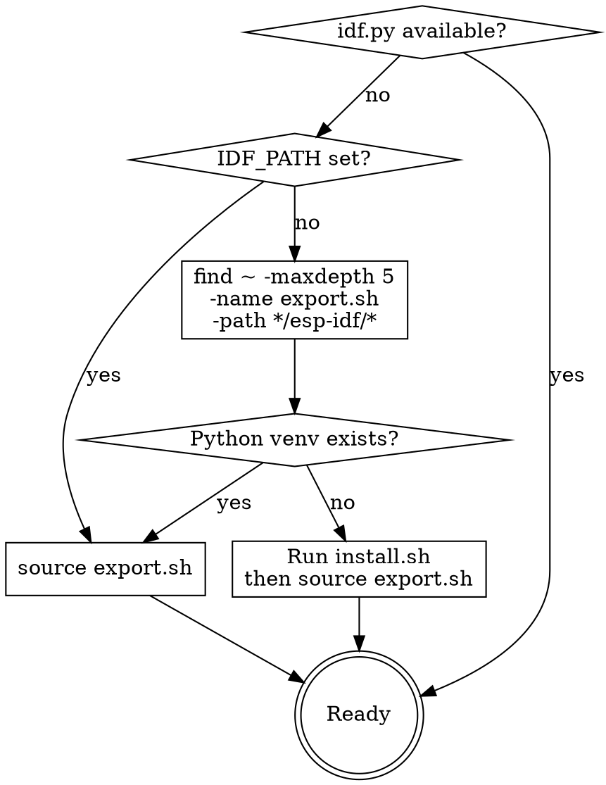

# ESP-IDF Environment Setup

## Overview

ESP-IDF requires environment variables sourced per-terminal session. The VS Code ESP-IDF extension manages this automatically, but CLI usage needs explicit sourcing.

## Quick Reference

| Task | Command |
|------|---------|
| Source IDF environment | `. $HOME/.espressif/<version>/esp-idf/export.sh` |
| Install Python venv (if missing) | `$HOME/.espressif/<version>/esp-idf/install.sh` |
| Check IDF version | `idf.py --version` |
| Fix serial permissions | `sudo usermod -aG dialout $USER` (then reboot) |
| Find serial port | `ls /dev/ttyUSB* /dev/ttyACM*` |
| Identify USB chip | `lsusb \| grep -iE "cp210\|ftdi\|espressif\|ch340"` |

## Environment Detection Flow



## Common Install Locations

- `~/esp/esp-idf/` (default from docs)
- `~/.espressif/<version>/esp-idf/` (VS Code extension installs here)
- `/opt/esp-idf/` (system-wide)

## VS Code Extension Settings

Minimal `.vscode/settings.json` for ESP-IDF:

```json
{
  "idf.currentSetup": "/path/to/esp-idf",
  "idf.port": "/dev/ttyUSB0",
  "idf.flashBaudRate": "460800",
  "idf.adapterTargetName": "esp32"
}
```

Key VS Code commands (`Ctrl+Shift+P`):

| Command | What it does |
|---------|-------------|
| `ESP-IDF: Configure ESP-IDF Extension` | Setup wizard |
| `ESP-IDF: Set Espressif Device Target` | Select chip (esp32, esp32s3, etc.) |
| `ESP-IDF: Select Port to Use` | Pick serial port |
| `ESP-IDF: Doctor Command` | Diagnose config issues |
| `ESP-IDF: Open ESP-IDF Terminal` | Terminal with IDF sourced |
| `ESP-IDF: SDK Configuration Editor` | GUI menuconfig |

## Serial Port Troubleshooting

**CH340/CP2102/FTDI not showing up:**
1. Check `lsusb` for the device
2. Check `dmesg | tail -20` for driver errors
3. Ensure kernel module loaded: `lsmod | grep ch341` (or `cp210x`, `ftdi_sio`)

**Permission denied on /dev/ttyUSB0:**
- Add user to `dialout` group: `sudo usermod -aG dialout $USER`
- Reboot (logout/login is not always sufficient)
- Verify: `groups | grep dialout`

## Bash Alias (Recommended)

Add to `~/.bashrc`:
```bash
alias get_idf='. $HOME/.espressif/v6.0/esp-idf/export.sh'
```
Then just type `get_idf` in any terminal.
