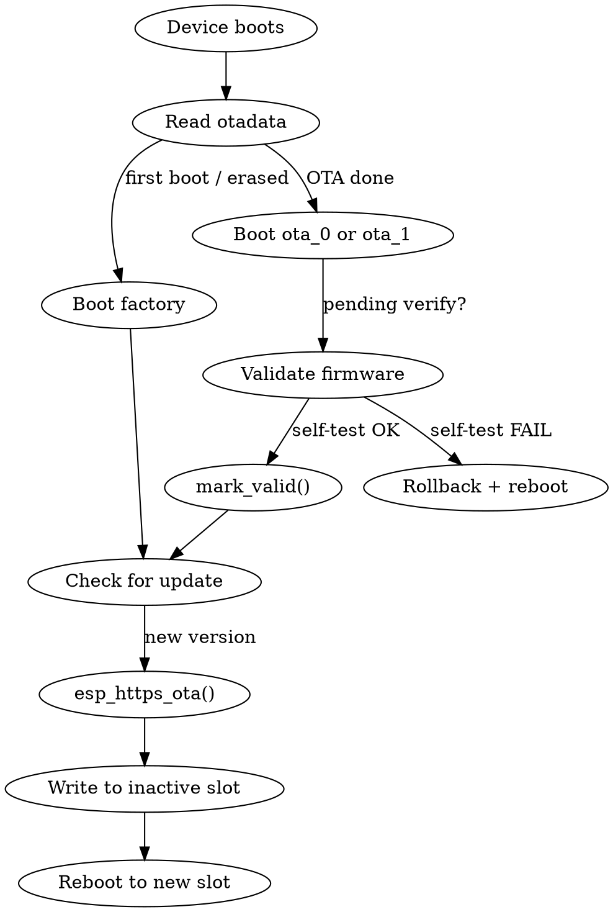

# ESP-IDF OTA Updates

## Overview

ESP-IDF OTA uses an A/B partition scheme: `factory` (initial firmware) + `ota_0`/`ota_1` (alternating update slots) + `otadata` (tracks active slot). The `esp_https_ota` API handles download, flash, and verification in one flow.

## Architecture



## Partition Table (OTA-capable)

```csv
# Name,    Type, SubType,  Offset,   Size,     Flags
nvs,       data, nvs,      0x9000,   0x6000,
otadata,   data, ota,      0xf000,   0x2000,
phy_init,  data, phy,      0x11000,  0x1000,
factory,   app,  factory,  0x20000,  0x1C0000,
ota_0,     app,  ota_0,    0x1E0000, 0x1C0000,
ota_1,     app,  ota_1,    0x3A0000, 0x1C0000,
coredump,  data, coredump, 0x560000, 0x10000,
```

**Critical:** `ota_0` and `ota_1` must be identical size and large enough for your firmware.

## sdkconfig.defaults for OTA

```ini
CONFIG_PARTITION_TABLE_CUSTOM=y
CONFIG_PARTITION_TABLE_CUSTOM_FILENAME="partitions.csv"
CONFIG_BOOTLOADER_APP_ROLLBACK_ENABLE=y
```

## Minimal OTA Implementation

### Simple (blocking, one-liner)

```c
#include "esp_https_ota.h"
#include "esp_log.h"

static const char *TAG = "ota";

// Embed server certificate (convert PEM to C array, or use menuconfig)
extern const uint8_t server_cert_pem_start[] asm("_binary_server_cert_pem_start");
extern const uint8_t server_cert_pem_end[]   asm("_binary_server_cert_pem_end");

esp_err_t start_ota(const char *url)
{
    esp_http_client_config_t http_config = {
        .url = url,
        .cert_pem = (const char *)server_cert_pem_start,
        .timeout_ms = 10000,
        .keep_alive_enable = true,
    };

    esp_https_ota_config_t ota_config = {
        .http_config = &http_config,
    };

    esp_err_t ret = esp_https_ota(&ota_config);  // Blocks until done
    if (ret == ESP_OK) {
        ESP_LOGI(TAG, "OTA succeeded, rebooting...");
        esp_restart();
    } else {
        ESP_LOGE(TAG, "OTA failed: %s", esp_err_to_name(ret));
    }
    return ret;
}
```

### With Progress Tracking

```c
esp_err_t start_ota_with_progress(const char *url)
{
    esp_http_client_config_t http_config = {
        .url = url,
        .cert_pem = (const char *)server_cert_pem_start,
        .timeout_ms = 10000,
    };

    esp_https_ota_config_t ota_config = {
        .http_config = &http_config,
    };

    esp_https_ota_handle_t handle = NULL;
    esp_err_t err = esp_https_ota_begin(&ota_config, &handle);
    if (err != ESP_OK) return err;

    while (1) {
        err = esp_https_ota_perform(handle);
        if (err != ESP_ERR_HTTPS_OTA_IN_PROGRESS) break;

        int total = esp_https_ota_get_image_size(handle);
        int read  = esp_https_ota_get_image_len_read(handle);
        ESP_LOGI(TAG, "OTA progress: %d/%d bytes (%d%%)",
                 read, total, (read * 100) / total);
    }

    if (err != ESP_OK) {
        esp_https_ota_abort(handle);
        return err;
    }

    err = esp_https_ota_finish(handle);
    if (err == ESP_OK) {
        ESP_LOGI(TAG, "OTA complete, rebooting...");
        esp_restart();
    }
    return err;
}
```

## Rollback (Critical for Production)

**Enable:** `CONFIG_BOOTLOADER_APP_ROLLBACK_ENABLE=y`

Add this to `app_main()`:

```c
#include "esp_ota_ops.h"

void app_main(void)
{
    const esp_partition_t *running = esp_ota_get_running_partition();
    esp_ota_img_states_t state;

    if (esp_ota_get_state_partition(running, &state) == ESP_OK
        && state == ESP_OTA_IMG_PENDING_VERIFY) {
        // New OTA firmware -- run self-diagnostics
        if (run_self_test()) {
            esp_ota_mark_app_valid_cancel_rollback();
            ESP_LOGI(TAG, "OTA firmware validated");
        } else {
            ESP_LOGE(TAG, "Self-test failed, rolling back!");
            esp_ota_mark_app_invalid_rollback_and_reboot();
        }
    }

    // ... normal app startup
}
```

**Self-test should verify:** Wi-Fi connects, sensors respond, critical peripherals work.

**Do NOT call `mark_valid()` immediately** -- validate first. Use a watchdog timer as safety net: if app hangs during validation, WDT reboot triggers rollback.

## Embedding the Server Certificate

Place your HTTPS server's CA certificate as `main/server_cert.pem`, then in `main/CMakeLists.txt`:

```cmake
idf_component_register(
    SRCS "main.c" "ota.c"
    INCLUDE_DIRS "."
    EMBED_TXTFILES "server_cert.pem"
)
```

## Secure OTA (Signed Images)

```bash
# Generate signing key (KEEP SAFE -- loss = no more updates)
espsecure.py generate_signing_key --version 2 secure_boot_signing_key.pem
```

Enable in menuconfig:
- `Security features > Require signed app images` (without full Secure Boot)
- Or `Security features > Enable hardware Secure Boot in bootloader (v2)` (full protection)

The build system signs images automatically. OTA images are verified before boot.

## Anti-Rollback (Version Protection)

Prevents flashing older firmware versions:
- `CONFIG_BOOTLOADER_APP_ANTI_ROLLBACK=y`
- Set `CONFIG_BOOTLOADER_APP_SECURE_VERSION` per release
- Version counter stored in eFuse (permanent, irreversible)

## OTA Best Practices

1. **Always HTTPS** -- never HTTP. Bundle/pin the server certificate.
2. **Always enable rollback** with thorough self-diagnostics.
3. **Track firmware version** via `esp_app_get_description()`.
4. **Monitor partition size** -- firmware must fit OTA slots.
5. **Handle network interruption** -- `esp_https_ota` resumes cleanly if connection drops mid-transfer.
6. **Test power-loss scenarios** -- verify device recovers after power cut during OTA.
7. **Check schedule** -- every 1-24 hours is typical. Avoid hammering server.
8. **Log OTA events** -- version before/after, success/failure, for fleet management.

## Testing OTA Locally

```bash
# 1. Build firmware and host it
idf.py build
cd build
python3 -m http.server 8070

# 2. For HTTPS, use a self-signed cert or mkcert
# 3. Point device to http://<your-ip>:8070/project_name.bin
# 4. For production, always use HTTPS
```

## Reset to Factory

```bash
idf.py -p /dev/ttyUSB0 erase-otadata
```

This clears the OTA data partition, causing the bootloader to fall back to the `factory` partition on next boot.
