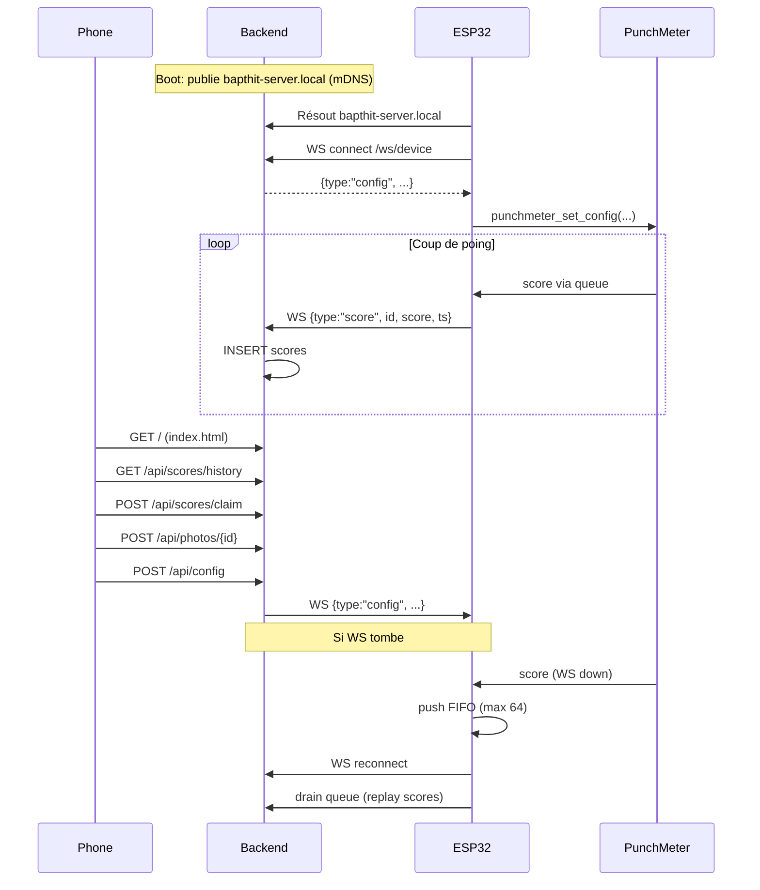

# ESP sonde + backend central — Design

**Date:** 2026-04-11
**Status:** Approved, ready for implementation plan

## Goal

Alléger au maximum la charge sur l'ESP32 en le transformant en **sonde pure** sur le WiFi
maison. Tout le reste (UI, API, DB, photos, logs, config source-of-truth) bascule sur le
backend FastAPI qui tourne sur le portable, connecté au même WiFi.

## Non-goals

- Supporter plusieurs ESP simultanément (un seul device).
- Persistance robuste des scores hors-ligne (jeu perso, reboot = on repart propre).
- Provisioning WiFi utilisateur-final (creds hardcodés au build).
- Tests unitaires formels.

## Background — architecture actuelle

- L'ESP tourne en **SoftAP** (`BAPTHIT`, 192.168.4.1) avec captive portal.
- `main/main.cpp` (~1250 lignes) : WiFi AP, HTTP server, URI handlers, serving
  `main/index.html` (~1586 lignes), endpoints `/api/scores`, `/api/config`, `/api/logs`,
  `/api/backend`, `/api/photo_ok`, etc.
- `backend/server.py` (FastAPI) tourne sur le portable connecté au SoftAP, stocke
  scores/photos en SQLite (`bapthit.db`), s'enregistre auprès de l'ESP via
  `POST /api/backend` pour lui donner son IP.
- Flow score-claim : téléphone → ESP (AP) → forward backend.
- Flow config : téléphone → ESP (HTTP) → applique localement.

## Contraintes & décisions

| Décision | Valeur |
|---|---|
| Mode WiFi ESP | **STA** (station), plus aucun AP |
| Credentials WiFi | Hardcodés via `sdkconfig.defaults.local` (gitignored) |
| Discovery backend | **mDNS**, `bapthit-server.local` publié par le backend |
| Transport ESP↔backend | **WebSocket** bidirectionnel, `ws://bapthit-server.local:6969/ws/device` |
| Serveur HTTP sur ESP | **Supprimé**, plus du tout |
| Hébergement UI web | Backend FastAPI sert `backend/static/index.html` |
| Config PunchMeter | **Source-of-truth backend** (SQLite), pushée par WS au `hello` et sur update |
| Scores hors-ligne | **FIFO RAM 64 slots**, replay au reconnect, drop du plus ancien si plein |
| ID des scores | Compteur RAM ESP (pas de NVS, reset au reboot) |
| Stratégie de migration | **Big bang** (une seule PR) |

## Architecture cible

```
[Téléphones] --HTTP--> [Backend FastAPI (portable)]
                              ^     |
                              |     | WS (bidirectionnel)
                              |     v
                       [ESP32 — STA, punchmeter + FIFO]
                              |
                              v
                       [LEDs + afficheur 7-seg]
```

## Composants

### Côté ESP (`main/`)

Le `main.cpp` passe de ~1250 à ~350 lignes. On supprime : captive portal, mode AP,
serveur HTTP, URI handlers, HTML serving, endpoints `/api/*` côté device. On garde/adapte :

| Module | Rôle |
|---|---|
| `wifi_sta.c/h` | WiFi en mode station, SSID/mdp via Kconfig, reconnexion auto sur disconnect |
| `ws_client.c/h` | Wrapper `esp_websocket_client` : connect, auto-reconnect, send JSON, callback `on_message` |
| `score_queue.c/h` | Ring buffer FIFO 64 slots (FreeRTOS queue), `push(score)` / `drain_to_ws()` |
| `app_main.cpp` | Orchestration : init NVS, WiFi STA, wait IP, resolve mDNS, start WS, lance tasks |
| `punchmeter_task` | `punchmeter_setup()` + `punchmeter_loop()`, push scores dans la queue |
| `uploader_task` | Draine la queue vers la WS, applique les messages entrants (config, ping) |
| `main/punchmeter_api.h` | Inchangé |
| `main/index.html` | **Supprimé** (déplacé dans `backend/static/`) |

Les credentials WiFi vont dans un `sdkconfig.defaults.local` gitignored (ou
`Kconfig.projbuild` équivalent) :

```
CONFIG_BAPTHIT_WIFI_SSID="..."
CONFIG_BAPTHIT_WIFI_PASS="..."
CONFIG_BAPTHIT_BACKEND_HOST="bapthit-server.local"
CONFIG_BAPTHIT_BACKEND_PORT=6969
```

### Côté backend (`backend/`)

`server.py` grossit un peu :

| Ajout | Rôle |
|---|---|
| `GET /` | Sert `static/index.html` |
| `/static/*` | `StaticFiles` pour assets |
| `WebSocket /ws/device` | Unique connexion ESP attendue. Reçoit `score`/`log`, envoie `config` |
| `DeviceManager` | Singleton gardant la WS active, expose `send_config()`, `is_connected()` |
| Table `config` en SQLite | Stocke la config PunchMeter source-of-truth |
| `zeroconf` mDNS publisher | Publie `_bapthit._tcp.local` sous `bapthit-server.local` (lifespan) |
| `POST /api/config` | UI met à jour la config → DB → `DeviceManager.send_config()` |
| `GET /api/logs` | Renvoie le buffer de logs reçus par WS |
| `POST /api/scores/claim` | Inchangé, mais ne forward plus à l'ESP |
| Endpoints supprimés | `register_with_esp32`, forward claim, forward photo_ok |

### Côté web UI (`backend/static/index.html`)

Déplacé quasi tel quel depuis `main/index.html`. Changements :

- URLs d'API qui ciblaient l'ESP → relatives au backend (même origine).
- Plus de "backend status" séparé — quand l'UI répond, le backend est par définition là.

## Data flow



## Protocole WebSocket

Messages JSON dans les deux sens, champ `type` qui route.

**ESP → backend :**
- `{"type":"hello","fw":"<version>"}` — premier message après connect
- `{"type":"score","id":<int>,"score":<int>,"ts":<epoch_s>}` — nouveau score (ou replay)
- `{"type":"log","level":"I|W|E","msg":"..."}` — optionnel, streaming des logs PunchMeter

**Backend → ESP :**
- `{"type":"config", ...PunchmeterConfig}` — envoyé après `hello` et à chaque update UI
- `{"type":"ping"}` — keepalive optionnel (sinon WS natif ping/pong suffit)

## Error handling

| Scénario | Comportement |
|---|---|
| WiFi STA échoue | `esp_wifi_connect()` retry en boucle, PunchMeter continue de jouer |
| mDNS resolve échoue | Retry toutes les 5 s |
| WS handshake/coupure | `esp_websocket_client` auto-reconnect avec backoff |
| FIFO plein | Drop du plus ancien, log warning |
| JSON invalide du backend | Ignore + log, pas de crash |
| Backend down, WiFi up | Reconnect-loop, FIFO tampon |
| ESP reboot | Queue RAM perdue, compteur IDs reset, backend ré-envoie config au `hello` |
| Config DB corrompue | Backend fallback sur defaults hardcodés |

## Testing

Pas de tests unitaires. Validation bout-en-bout manuelle sur l'ESP dev branché
(`/dev/ttyUSB0`) :

1. **WiFi STA** : flash + monitor, voir l'ESP obtenir une IP.
2. **mDNS** : `avahi-browse -art` depuis le portable, voir le service publié.
3. **WS** : logs "Device connected" (backend) et "WS CONNECTED" (ESP).
4. **Score E2E** : taper PunchMeter, voir le score dans `sqlite3 bapthit.db`.
5. **UI** : `http://bapthit-server.local:6969/` dans Chrome, score visible, claim, photo.
6. **Config round-trip** : modifier dans l'UI → l'ESP log "config received" → comportement change.
7. **Offline/replay** : tuer backend, taper 3 coups, relancer, vérifier les 3 scores arrivent.

## Ressources disponibles pendant l'implémentation

- Serial `/dev/ttyUSB0` + `idf.py monitor`
- MCP Chrome pour tester l'UI en live
- Backend en foreground pour voir les logs uvicorn
- `sqlite3 backend/bapthit.db` pour inspecter la DB

## Out of scope (pour plus tard éventuellement)

- Persistance NVS du compteur d'IDs
- Multi-ESP
- Provisioning WiFi user-friendly
- Tests unitaires ESP / pytest backend
- HTTPS/WSS
- Authentification WS (token partagé)
