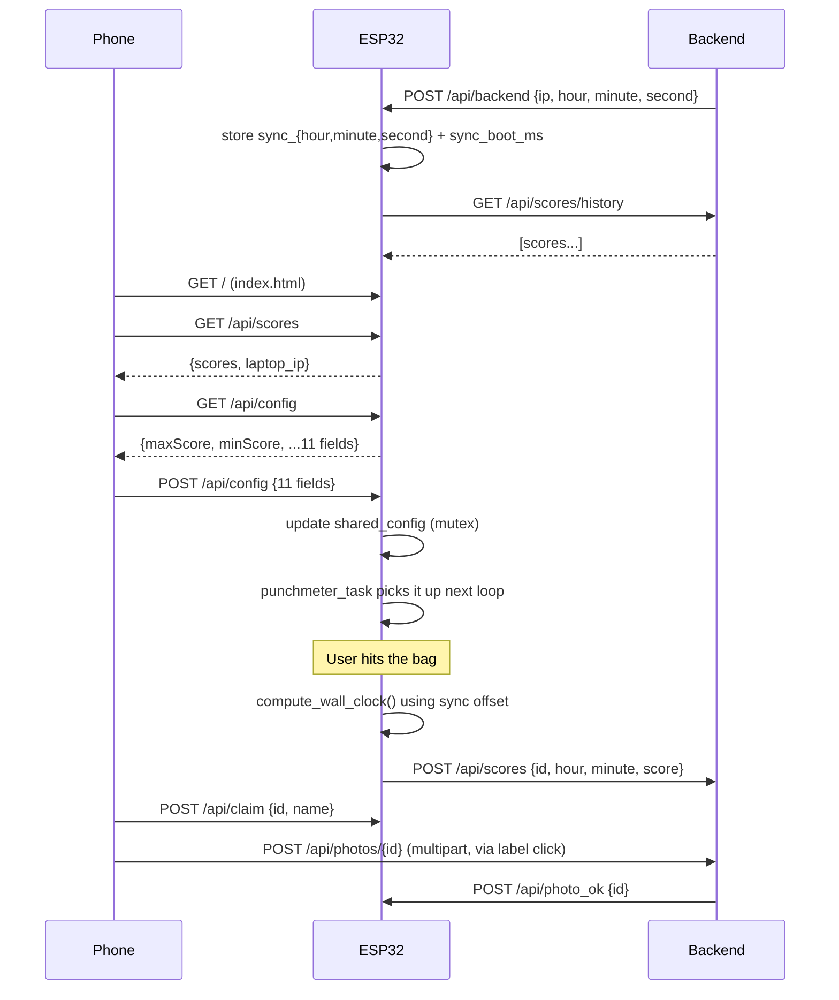

# Feature request batch — config, time sync, photo fix

**Date:** 2026-04-11
**Scope:** Three independent features/fixes batched into one iteration.

---

## 1. Photo upload bug — "rien ne se passe" on mobile

### Problem

In the claim modal, tapping the "Photo" button does nothing on the user's phone. The goal is to take a selfie for the score.

Current HTML (`main/index.html:772-773`):

```html
<button class="claim-photo-btn"
        onclick="document.getElementById('claim-photo-input').click()">Photo</button>
<input type="file" id="claim-photo-input" accept="image/*"
       capture="environment" style="display:none" onchange="previewClaimPhoto(this)">
```

Two combined issues:

1. **Programmatic `.click()` on a hidden input** is blocked by mobile captive-portal browsers
   (iOS CPWebKit, Android captive WebView): the synthetic click is not considered
   user-initiated, so the file picker is silently dropped.
2. `capture="environment"` forces the rear camera — wrong facing for a selfie.

### Fix

Replace the button/hidden-input forwarding pattern with a `<label>` wrapping a
visually-hidden input. The tap lands directly on the label, which is semantically
bound to the input — the browser receives a real user event and opens the native
camera app without any JS intermediation.

```html
<label class="claim-photo-btn">
  <span>Selfie</span>
  <input type="file" id="claim-photo-input" accept="image/*"
         capture="user" onchange="previewClaimPhoto(this)">
</label>
```

The input is hidden via CSS (`position: absolute; opacity: 0; pointer-events: none;`
inside the label) so the label remains the click target. `capture="user"` opens
the front camera for a selfie.

This is the native mobile web pattern — tapping the label triggers the phone's
native camera app (iOS Camera, Android MediaStore intent), not a web-hosted video feed.

---

## 2. PunchMeter config — expose all interface values to the app

### Problem

`components/punchmeter/src/punchmeter.cpp` has a block labelled "Interface values
definition" with 11 tunable variables. Only `maxScore` and `minScore` are currently
exposed to the app via `PunchmeterConfig`. The user wants all 11 editable from the
Settings panel.

The 11 values, with current defaults:

| name               | type            | default |
|--------------------|-----------------|---------|
| maxScore           | unsigned long   | 20000   |
| minScore           | unsigned long   | 100000  |
| defaultRollDelay   | int             | 15      |
| rollDelayMod       | int             | 1       |
| rollThresh         | int             | 60      |
| slowRollThresh     | int             | 7       |
| slowRollDelayMod   | int             | 100     |
| defaultIncrement   | int             | 15      |
| blinkDelay         | int             | 600     |
| waveDuration       | int             | 1       |
| waveDelay          | int             | 200     |

### Changes

#### Submodule `components/punchmeter` (additive, no refactor)

- **`punchmeter.h`** — extend the existing `PunchmeterConfig` struct with the 9
  missing fields. Same pattern the colleague already established with
  `maxScore`/`minScore`. No renaming, no reordering.

  ```cpp
  struct PunchmeterConfig {
      unsigned long maxScore;
      unsigned long minScore;
      int defaultRollDelay;
      int rollDelayMod;
      int rollThresh;
      int slowRollThresh;
      int slowRollDelayMod;
      int defaultIncrement;
      int blinkDelay;
      int waveDuration;
      int waveDelay;
  };
  ```

- **`punchmeter.cpp`** — in `punchmeter_set_config()`, copy the 9 new fields into
  the existing file-level statics. No logic change, same pattern as the existing
  two assignments.

Respects the "minimal changes to PunchMeter" rule: purely additive, follows the
API shape the colleague defined himself, ~15-line diff.

#### `main/punchmeter_api.h`

Mirror the same 11 fields in the forward declaration that `main.cpp` uses
(purpose of this header is to avoid pulling `Arduino.h` into main).

#### `main/main.cpp`

- Extend `shared_config_t` with all 11 fields, initialised with the same defaults
  as the submodule.
- Extend the existing POST `/api/config` handler to parse the 9 new keys
  (incremental extension of the manual JSON parser). Missing keys = no update,
  so clients can send a partial patch.
- Add a new **GET `/api/config`** handler that serialises the current
  `shared_config` to JSON. Required so the UI can pre-populate the form.

#### `main/index.html`

Add a config form inside the Settings sheet, after the Backend status block:

- Section header "Config PunchMeter"
- One labelled numeric input per field (11 total), grouped visually
- A "Enregistrer" button at the bottom
- On Settings sheet open: `fetch('/api/config')` → populate inputs
- On save click: `POST /api/config` with the full JSON of all 11 fields
- Inline success/error feedback under the button

### Non-goals

**No NVS persistence.** Config resets to defaults on reboot. Simpler now; can be
added later if it becomes annoying.

---

## 3. Time sync at backend register

### Problem

ESP32 computes score timestamps from `esp_timer_get_time()` (milliseconds since
boot), so the "time" shown next to each score starts at 00h00 at every boot and
increments from there — not a real wall clock.

The user wants the ESP32 to use the laptop's clock as a reference.

### Approach — one-shot sync at register, no timezones, no `time.h`

When the backend registers with the ESP32, it also sends the current local time
as three integers. The ESP32 stores them along with a boot-time reference, then
computes wall-clock time on the fly when a score arrives.

#### Backend — `backend/server.py`

In `register_with_esp32`, extend the payload:

```python
from datetime import datetime
now = datetime.now()
await client.post(
    f"http://{ESP32_IP}/api/backend",
    json={
        "ip": my_ip,
        "hour": now.hour,
        "minute": now.minute,
        "second": now.second,
    },
)
```

#### ESP32 — `main/main.cpp`

New statics:

```c
static int     sync_hour = 0, sync_minute = 0, sync_second = 0;
static int64_t sync_boot_ms = 0;
static bool    time_synced = false;
```

In `backend_register_handler`, after parsing the IP, also parse `hour`, `minute`,
`second` from the JSON body and freeze:

```c
sync_hour    = parsed_hour;
sync_minute  = parsed_minute;
sync_second  = parsed_second;
sync_boot_ms = esp_timer_get_time() / 1000;
time_synced  = true;
```

New helper:

```c
static void compute_wall_clock(int *out_hour, int *out_minute) {
    if (!time_synced) {
        int64_t ms = esp_timer_get_time() / 1000;
        int64_t total_min = ms / 60000;
        *out_hour   = (int)(total_min / 60) % 24;
        *out_minute = (int)(total_min % 60);
        return;
    }
    int64_t now_ms   = esp_timer_get_time() / 1000;
    int64_t delta_s  = (now_ms - sync_boot_ms) / 1000;
    int64_t total_s  = (int64_t)sync_hour * 3600
                     + (int64_t)sync_minute * 60
                     + sync_second + delta_s;
    int64_t day_s    = ((total_s % 86400) + 86400) % 86400;
    *out_hour   = (int)(day_s / 3600);
    *out_minute = (int)((day_s / 60) % 60);
}
```

In `drain_score_queue()`, replace the uptime-based hour/minute calculation with
a call to `compute_wall_clock()`.

### Properties

- **Zero timezone handling.** Backend sends local wall clock as three ints.
- **Graceful fallback.** If backend is unreachable, `!time_synced` → existing
  uptime-based behaviour, no regression.
- **No re-sync.** Drift of a few seconds per hour is acceptable for the MVP.
  Periodic re-sync can be added later.
- **Persisted scores unaffected.** History fetched via `/api/scores/history`
  keeps its original `hour`/`minute` from the SQLite DB.

---

## Data flow — register + config + score lifecycle



---

## Build & deploy

After implementation:

1. `make build` → regenerate `build/bapthit.bin`
2. User flashes via OTA (Settings → drop .bin) or via `make flash`.
