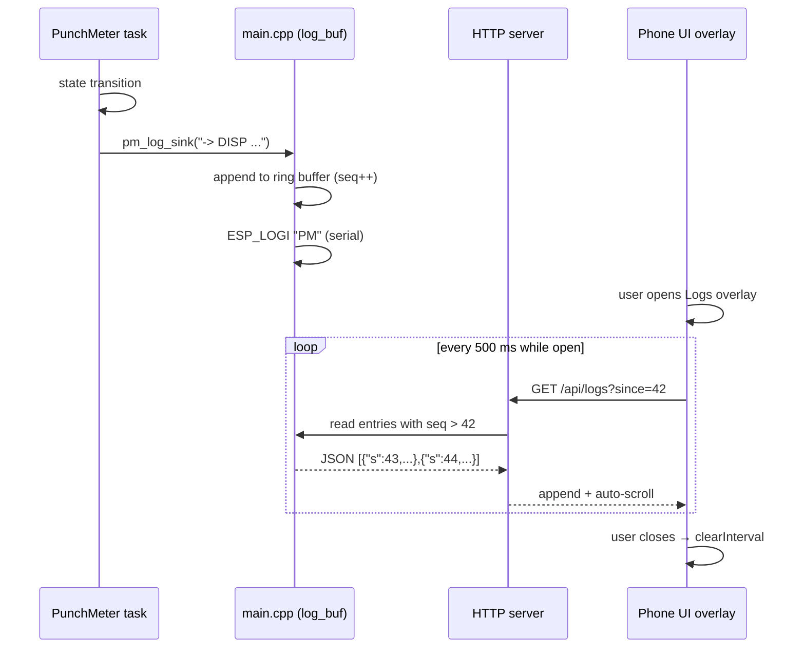

# PunchMeter logs — instrumentation + in-app viewer

**Date:** 2026-04-11
**Scope:** Add enough PunchMeter state-machine instrumentation to diagnose
the "LEDs stay off after a hit" bug (and future bugs), plus a full-screen
in-app log viewer reachable from Settings.

---

## Context & preliminary diagnosis

User reports: after hitting the bag, the LEDs turn off and never come back.
On the currently-flashed firmware (turn N), which bumped the default
`minScore` from 500000 to 100000 µs.

A code read of `components/punchmeter/src/punchmeter.cpp` surfaces a suspect
condition in the DISP state:

```cpp
if (lastBlinkDate > millis() + blinkDelay) {
    lastBlinkDate = millis();
    if (isDisplayOff) displayScore(last_score);
    else clearDisplay();
}
```

`lastBlinkDate` is set to `millis()` just before entering DISP (line 114).
`millis()` is monotonically increasing, so `lastBlinkDate <= millis()` always.
The condition `lastBlinkDate > millis() + blinkDelay` is **always false** —
the blink logic never runs. Once `clearDisplay()` fires at the end of MEAS,
the display stays off in DISP.

The condition was almost certainly meant to be
`millis() > lastBlinkDate + blinkDelay`.

**We are not fixing it.** The "Minimal changes to PunchMeter" rule applies —
the colleague owns this code. Instead, we add logs that make the wrong
behaviour visible (logging `lastBlinkDate` and `now` at DISP entry), and
the user escalates to the colleague with the evidence.

The user has also added `delay(1000)` calls before the DISP→READY and
DISP→IDLE transitions (intentional, left in place). They slow state exits
but do not cause the LED-off symptom.

---

## 1. Logging hook in the PunchMeter submodule

**Goal:** add instrumentation without pulling ESP-IDF headers into the
submodule (so the colleague's standalone Arduino build keeps compiling).

### Header — `components/punchmeter/src/punchmeter.h`

Add a typedef + prototype:

```cpp
typedef void (*punchmeter_log_fn)(const char *msg);
void punchmeter_set_logger(punchmeter_log_fn fn);
```

### Implementation — `components/punchmeter/src/punchmeter.cpp`

Add a static callback pointer and a varargs helper:

```cpp
static punchmeter_log_fn pm_logger = NULL;

void punchmeter_set_logger(punchmeter_log_fn fn) {
    pm_logger = fn;
}

static void pm_log(const char *fmt, ...) {
    if (!pm_logger) return;
    char buf[120];
    va_list ap;
    va_start(ap, fmt);
    vsnprintf(buf, sizeof(buf), fmt, ap);
    va_end(ap);
    pm_logger(buf);
}
```

### Instrumentation points

Six log calls, at natural state-machine boundaries:

| Location                              | Log line                                               |
|---------------------------------------|--------------------------------------------------------|
| entry to `IDLE` (from any state)      | `pm_log("-> IDLE")`                                    |
| entry to `READY`                      | `pm_log("-> READY")`                                   |
| entry to `MEAS`                       | `pm_log("-> MEAS start=%lu", start)`                   |
| after score computation in MEAS       | `pm_log("score raw=%luus final=%d", raw_us, last_score)` |
| entry to `DISP`                       | `pm_log("-> DISP lastBlink=%lu now=%lu", lastBlinkDate, millis())` |
| `punchmeter_set_config` called        | `pm_log("config updated: max=%lu min=%lu", ...)`       |

Standalone builds that never call `punchmeter_set_logger` get zero overhead:
every `pm_log()` returns immediately after the NULL check.

### Minimal-changes rule compliance

All additive:
- new typedef + prototype in the header
- new static pointer + helper in the cpp
- 6 call sites inside existing state-machine code

No renaming, no refactor, no fix of the broken blink condition.

---

## 2. Ring buffer + `/api/logs` endpoint in `main/main.cpp`

### Ring buffer

```c
#define LOG_BUF_SIZE 64
#define LOG_MSG_LEN 120

typedef struct {
    uint32_t seq;      // monotonic counter, 0 = empty slot
    uint32_t ts_ms;    // esp_timer_get_time() / 1000, truncated
    char     msg[LOG_MSG_LEN];
} log_entry_t;

static log_entry_t log_buf[LOG_BUF_SIZE];  // zero-initialised
static int         log_head = 0;           // next write position
static uint32_t    log_next_seq = 1;       // starts at 1 so seq=0 means empty
static SemaphoreHandle_t log_mutex;
```

64 × (8 + 120) ≈ 8 KB on BSS. Acceptable.

### Sink callback

Registered at boot via `punchmeter_set_logger(pm_log_sink)`:

```c
static void pm_log_sink(const char *msg) {
    if (!log_mutex) return;
    xSemaphoreTake(log_mutex, portMAX_DELAY);
    log_entry_t *e = &log_buf[log_head];
    e->seq = log_next_seq++;
    e->ts_ms = (uint32_t)(esp_timer_get_time() / 1000);
    // Sanitize for JSON: drop ", \, and non-printable
    int j = 0;
    for (int i = 0; msg[i] && j < LOG_MSG_LEN - 1; i++) {
        char c = msg[i];
        if (c != '"' && c != '\\' && c >= 0x20) e->msg[j++] = c;
    }
    e->msg[j] = '\0';
    log_head = (log_head + 1) % LOG_BUF_SIZE;
    xSemaphoreGive(log_mutex);
    ESP_LOGI("PM", "%s", msg);  // also visible on the serial monitor
}
```

### Endpoint — `GET /api/logs?since=<seq>`

Returns entries with `seq > since`, in chronological order, as JSON:

```json
{
  "logs": [
    {"s": 43, "t": 2104, "m": "-> MEAS start=2104000"},
    {"s": 44, "t": 2189, "m": "score raw=85000us final=872"}
  ]
}
```

Implementation iterates the buffer starting at the oldest slot
(`(log_head + 1) % SIZE`), skipping entries with `seq == 0` or `seq <= since`.
Max payload ≈ 64 × 160 ≈ 10 KB → a 12 KB malloc is enough.

Register on `HTTP_GET /api/logs` in `start_webserver`, before the wildcard
captive-portal handler (same ordering concern as `/api/config`).

---

## 3. Full-screen logs overlay in `index.html`

### Trigger

A "Logs" button inside the Settings sheet, below Config PunchMeter. Click
opens a separate full-screen overlay (z-index above the settings sheet).

### Overlay structure

```
┌─────────────────────────────────┐
│ LOGS PUNCHMETER            [✕]  │  ← header
├─────────────────────────────────┤
│ [1.523]  -> READY               │
│ [2.104]  -> MEAS start=2104000  │
│ [2.189]  score raw=85000us      │
│          final=872              │
│ [2.189]  -> DISP lastBlink=2189 │
│          now=2189               │
│ ...                             │
├─────────────────────────────────┤
│ [ Clear ]  [ Pause ]            │  ← footer
└─────────────────────────────────┘
```

- Dark background, monospace font, scrollable list.
- Timestamps formatted as `[s.mmm]` relative to a static reference
  (the first `ts_ms` seen, to keep numbers small and readable).
- **Sticky-bottom auto-scroll:** if the user has scrolled to within 50 px
  of the bottom, new entries auto-scroll. If they scrolled up, new entries
  append silently and a "↓ N new" chip appears to jump back down.
- **Clear button:** empties the on-screen list. Does not clear the ESP32
  buffer (next poll re-fetches from the current `last_seq`).
- **Pause button:** stops polling. Resume button takes over.

### Polling

- `setInterval` at 500 ms while overlay is visible.
- Tracks `lastSeq` (init 0).
- `fetch('/api/logs?since=' + lastSeq)` → append each returned entry,
  update `lastSeq` to the max.
- Stop on close or Pause.

### Non-goals

- No log levels (everything is INFO).
- No filtering / search.
- No persistence — buffer resets on reboot.
- No SSE / WebSocket — polling is enough at this volume.

---

## Data flow



---

## Build & deploy

After implementation:

1. `bash -c '. /home/llenoir/.espressif/v6.0/esp-idf/export.sh >/dev/null 2>&1 && idf.py build'`
2. Flash via OTA (Settings → drop .bin) or serial (`make flash`).
3. Open Settings → Logs → reproduce the hit sequence → read the logs to
   confirm the DISP blink hypothesis.
